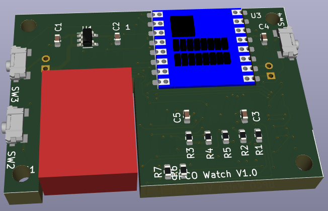
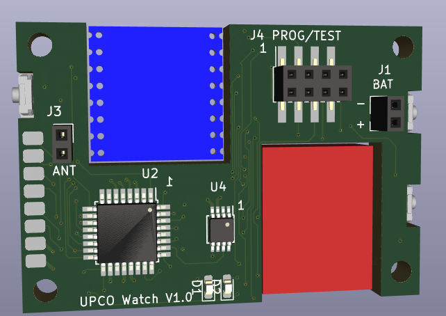

# Smart Watch

Imagining a device similar to a smart watch, but not intended to
connect to a phone and generate alerts.  Instead, I'd like:

* Large, easy-to-read e-ink time display
* Auxiliary info (possibly selected using button):
   * Multiple timezones
   * Alarm/timer time
   * Weather info
   * Any other not-quite realtime info pushed via WiFi

The watch would link to base stations at home and at work for updates.
This could be WiFi (power hungry!), or something like RFM69 (915 MHz).

The idea would be that the watch has WiFi but only powers up every 10min or
so and tries to connect to the last AP, otherwise tries a short list of AP.
Some fairly smart algorithm should recognize when not near an AP and give up,
checking at longer intervals.  A button press should be available to force
WiFi update.

## Rev 1.0

Ordered PCBs and BOM parts (Mouser) on 12/2/22.  

3D PCB view: 

 

* [schematic](watch-pcb/watch-sch.pdf)

### Display

Ordered a black/red display from buydisplay.com.  This works ok but has
a ~15s refresh time and doesn't support fast/partial refresh.  My bad!

Ordered another from waveshare which is monochrome and does support
partial refresh.  Holding off on buying anything else until the display
part is working reasonably.

* Waveshare [page](https://www.waveshare.com/product/displays/e-paper/1.54inch-e-paper-module.htm?___SID=U)
[wiki](https://www.waveshare.com/wiki/1.54inch_e-Paper_Module) [data](https://www.waveshare.com/w/upload/e/e5/1.54inch_e-paper_V2_Datasheet.pdf)

This is reasonable, just a bit big.  Another alternative is the waveshare
1.02inch display.

### Radio

Meanwhile, Carlos (of MLRC) suggests BLE or VHF radio as an alternative
to WiFi.  This would require a bit of setup but would be much lower power.

#### VHF/UHF

RFM69 [data](https://cdn.sparkfun.com/datasheets/Wireless/General/RFM69HCW-V1.1.pdf) is 
interesting, but needs a 3 inch antenna.  Possibly it would work
OK if wrapped around the watch band?  These things are cheap ($6.50 for COM-13909 from
Sparkfun).  3.3V.  Needs 16mA to receive, 16..130mA to transmit (depends on settings).
Bit rates are modem-ish up to 156k.  Claims 50m range indoors.
Module is about 0.8" x 0.8" (20.3mm)

nRF24L01 and friends.  2.4GHz.  Bit rate s 250/1M/2M.  Power for Rx:
8.9-13.5mA Power for Tx: 8-11mA.  Fancier protocol with packet
retransmit, etc.  $21 each for WRL-00691.

#### ESP-01

ESP-01 Power Consumption:  
* 170mA working worst case
* 0.9mA "light sleep"
* 10uA "deep sleep"

Datasheet says "...sleep 300s and waking up to connect to the AP
(taking about 0.3~1s), the overall average current is less than 1mA.
Not clear how this is affected if multiple AP must be tried.  Need
to get some ESP-01 and play with them.

So we're looking at ~1mA minimum average power with capability to
deliver ~200mA.  For few days running it would be nice to have
~100mAh.

It seems that on ESP-01 modules you need to wire pin 8 to nRESET so it
can self-wake out of deep sleep.  Otherwise you can just call
ESP.deepSleep(0) and then use the MCU to pulse reset to wake it up.
(see
[note](https://www.tech-spy.co.uk/2019/04/enable-deep-sleep-esp-01/))

## Doco

* Display: [Mfgr page](https://www.buydisplay.com/red-1-54-inch-e-ink-display-module-200x200-for-arduino-raspberry-pi)
* eInk.md

## Parts?

* MCU:  ATMega1281-16AUR (64-TQFP)
   * Chosen for it's 8K RAM size so it can hold a 200x200 bitmap for the display
* RTC: 
   * Nisshinbo R2043T-E2-F (2129-R2043T-E2-FCT-ND).  10-VFSOP
   * Nisshinbo R2025S-E2-FE (2129-R2025S-E2-FECT-ND).  14-SOIC
* Thru pin socket
   * Mill-Max 0305-2-15-80-47-27-10-0  (0305-2-15-80-47-27-10-0)
* Side-mount switch
   * Panasonic EVQ-P4MB3K (P15507CT-ND)
* Battery Holder for CR1216
   * Linx BAT-HLD-012-SMT (BAT-HLD-012-SMT-ND)
* or Lipo battery.  There seem to be 100mAh batts 18x14.7mm which are
  cheap ($16/4 on Amazon with a little USB charger thing).  These are
  3.7V so we need a small-ish 3.3V LDO.
* WiFi
   * ESP-01 [data](https://www.microchip.ua/wireless/esp01.pdf)

